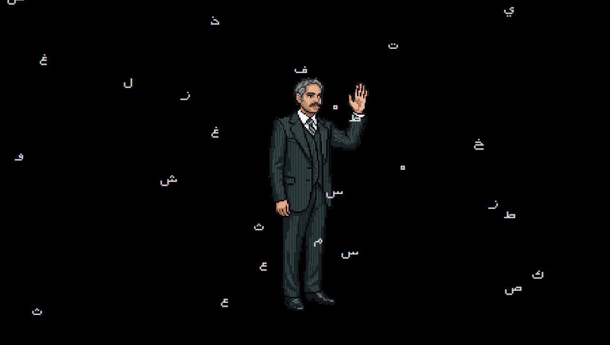

# Sakhr Simulator — محاكاة صخر

<p align="center">
  
</p>

<p align="center">
  <em>An interactive animated documentary about Sakhr — the Arab computer that arabized the world</em>
<br/><br/>
Designed, written, and commissioned by <a href="https://kayfa-ta.com/">Kayfa Ta</a>
</p>

---

## Overview

**Sakhr Simulator** is a web-based animated storytelling system that chronicles the history of **Sakhr MSX computers** — the pioneering Arabic-language computing platform developed in the 1980s that brought the Arabic language to personal computers across the Arab world.

The project is a **4-chapter animated film** rendered entirely in the browser using vanilla JavaScript, pixel-art assets, and a custom timeline animation engine. It is optimized for the **GeeekPi 10.1" screen (1280×800)** and runs on Raspberry Pi hardware, as well as any modern desktop browser.

It also includes a **WebMSX ROM emulator** with an Arabic-first interface to actually run original Sakhr software cartridges.

---

## Features

- **4-chapter animated story** — 22+ scenes covering Sakhr's history from founding to legacy
- **Custom animation engine** — timeline-based scene player with typewriter text, sprite animation, parallax, and transition effects
- **RTL Arabic UI** — fully right-to-left, Arabic-first design
- **Pixel-art aesthetic** — custom sprites and backgrounds in the retro MSX style
- **Background music support** — per-chapter audio with fade in/out
- **WebMSX ROM loader** — browse and launch original Sakhr ROM cartridges
- **Standalone chapter players** — each chapter is a self-contained HTML file
- **Raspberry Pi ready** — runs on Chromium in fullscreen at 1280×800

---

## Project Structure

```
animation/
│
├── engine/                        # Shared animation engine (vanilla JS)
│   ├── engine.js                  # Core scene player (timeline-based)
│   ├── chapter-player.js          # Chapter sequencer (auto-advances scenes)
│   ├── typewriter.js              # Typewriter text effect
│   ├── sprite-animator.js         # Sprite frame animation
│   └── audio-player.js            # Background music player
│
├── styles/
│   ├── animation-base.css         # Base layout for 1280×800
│   └── text-boxes.css             # Text overlay styles
│
├── fonts/                         # Custom fonts (FF Sakhr, MSX International)
├── fonts.css                      # Font-face declarations
│
├── audio/                         # Background music (MP3 files, not included)
│
├── ch1/                           # Chapter 1 (7 scenes)
│   ├── ch1-player-standalone.html # ← Open this to watch Chapter 1
│   ├── scenes.json                # Scene manifest
│   └── sc1/ … sc7/               # Scene folders (scene.json + assets)
│
├── ch2/                           # Chapter 2 (5 scenes)
│   ├── ch2-player-standalone.html
│   ├── scenes.json
│   └── sc1/ … sc5/
│
├── ch3/                           # Chapter 3 (3 scenes)
│   ├── ch3-player-standalone.html
│   ├── scenes.json
│   └── sc1/ … sc3/
│
├── ch4/                           # Chapter 4 (7 scenes)
│   ├── ch4-player-standalone.html
│   ├── scenes.json
│   └── sc1/ … sc7/
│
└── emulator/                      # WebMSX ROM loader
    ├── index.html                 # Arabic ROM grid selector
    ├── emulator.html              # WebMSX emulator page
    ├── images/                    # ROM cover images
    └── webmsx/                    # WebMSX engine files
```

---

## Installation & Running

### Option 1 — Direct file (simplest)

Just open any chapter player directly in your browser:

```
animation/ch1/ch1-player-standalone.html
animation/ch2/ch2-player-standalone.html
animation/ch3/ch3-player-standalone.html
animation/ch4/ch4-player-standalone.html
```

> **Note:** Some browsers block `fetch()` for local files. If scenes don't load, use Option 2.

---

### Option 2 — Local HTTP server (recommended)

**Using Python:**

```bash
cd animation
python -m http.server 8080
```

Then open: [http://localhost:8080/ch1/ch1-player-standalone.html](http://localhost:8080/ch1/ch1-player-standalone.html)

**Using Node.js (npx):**

```bash
cd animation
npx serve .
```

---

### Option 3 — Raspberry Pi (Chromium kiosk)

```bash
# Clone the repo
git clone https://github.com/ishabana/Sakhr-simulator.git
cd Sakhr-simulator

# Start a local server
python3 -m http.server 8080 &

# Open Chromium in fullscreen kiosk mode
chromium-browser --kiosk http://localhost:8080/ch1/ch1-player-standalone.html
```

> The display is optimized for **1280×800** (GeeekPi 10.1" touchscreen). For other resolutions, adjust `animation-base.css`.

---

## Adding Background Music

Music files are not included in the repository. To add music:

1. Create MP3 files for each chapter
2. Place them in `audio/music/`:

```
audio/music/ch1-theme.mp3
audio/music/ch2-theme.mp3
audio/music/ch3-theme.mp3
audio/music/ch4-theme.mp3
```

Music will loop automatically during playback. Scenes work fine without music files.

---

## WebMSX ROM Emulator

The `emulator/` folder contains an Arabic-first ROM selector for the WebMSX emulator.

**To use:**
1. Obtain Sakhr ROM files (`.rom`) — not included for copyright reasons
2. Place them in the WebMSX roms directory (see `emulator/ROMS_SETUP.md`)
3. Open `emulator/index.html` in a browser
4. Click a ROM to launch it in the emulator

**Keyboard shortcuts in emulator:**
- `ESC` — Return to ROM selection menu
- `F7` — WebMSX menu
- Arrow keys — Navigate ROM grid

---

## Scene Configuration

Each scene is defined in a `scene.json` file. Example:

```json
{
  "duration": 15000,
  "background": "bg.png",
  "autoAdvance": true,
  "advanceDelay": 1000,
  "timeline": [
    {
      "time": 0,
      "action": "showText",
      "config": {
        "id": "narration",
        "text": "في عام ١٩٨٢...",
        "type": "overlay",
        "position": { "x": "center", "y": "10%" },
        "animation": { "type": "typewriter", "speed": 80 }
      }
    },
    {
      "time": 7000,
      "action": "showSprite",
      "config": {
        "id": "character",
        "src": "still.png",
        "position": { "x": "50%", "y": "20%" }
      }
    }
  ]
}
```

**Supported timeline actions:**
| Action | Description |
|--------|-------------|
| `showText` | Display text with optional typewriter effect |
| `hideText` | Remove a text element |
| `showSprite` | Display a static or animated sprite |
| `hideSprite` | Remove a sprite |
| `animateSprite` | Play frame-by-frame sprite animation |
| `playAudio` | Play a sound effect |

---

## Keyboard Controls (Chapter Players)

| Key | Action |
|-----|--------|
| `Space` | Pause / Resume |
| `R` | Restart chapter |
| `←` / `→` | Previous / Next scene |

---

## Browser Compatibility

| Browser | Status |
|---------|--------|
| Chrome / Chromium | ✅ Full support |
| Firefox | ✅ Full support |
| Edge | ✅ Full support |
| Safari | ✅ Full support |
| IE / Legacy | ✗ Not supported |

---

## Design

- **Resolution:** 1280 × 800 px
- **Font (Arabic):** FF Sakhr — a custom monospace Arabic font
- **Font (English/Latin):** MSX International — retro monospace
- **Palette:** Dark/black backgrounds, white Arabic text, Sakhr blue (`#2424FF`), yellow (`#DBDB00`)
- **Art style:** Pixel art, retro MSX aesthetic

---

## Story Chapters

| Chapter | Title | Scenes | Theme |
|---------|-------|--------|-------|
| 1 | الفصل الأول — The Beginning | 7 | Founding of Sakhr, the vision to arabize computing |
| 2 | الفصل الثاني — The Rise | 5 | Expansion across the Arab world, software catalog |
| 3 | الفصل الثالث — The Peak | 3 | Height of Sakhr's influence, educational programs |
| 4 | الفصل الرابع — The Legacy | 7 | Decline of MSX, lasting impact on Arab computing |

---

## License

This project is for educational and cultural preservation purposes, documenting the history of Arabic computing.

---

<p align="center">
  صُنع بحب للتراث الحاسوبي العربي
  <br/>
  <em>Made with love for Arab computing heritage</em>
</p>
